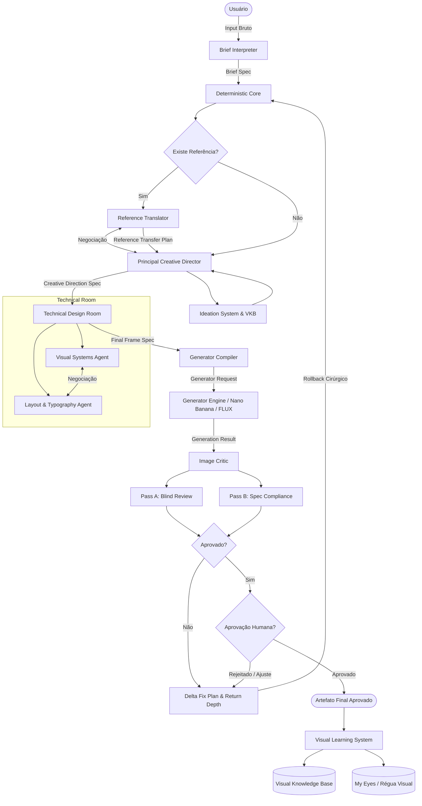

# Especificação Arquitetural do Sistema: DESIGN BUILDER

**Autor:** Manus AI  
**Versão:** 1.0.0  
**Status:** Oficial / Especificação Executável  

---

## 1. Premissa Central

O sistema **Design Builder** não deve ser interpretado como um pipeline simplista de encaminhamento de prompt (`User -> Prompt -> Gerador`). Ele opera como um **sistema autônomo de direção criativa**, projetado para replicar e automatizar o rigor metodológico, a deliberação estética, a crítica visual e o controle determinístico de um estúdio de design de altíssimo nível.

O objetivo arquitetural é estruturar a colaboração entre agentes cognitivos especialistas, bases de conhecimento visual, memórias de avaliação e um núcleo de execução determinístico. A premissa fundamental que rege todo o desenho do sistema estabelece que **tokens e chamadas de LLM não representam restrições de custo ou escopo primárias; a prioridade absoluta é a qualidade estética, semântica e funcional da peça final**.

```
+-----------------------------------------------------------------------------------+
|                            DESIGN BUILDER ECOSYSTEM                               |
|                                                                                   |
|  +--------------------+     +-------------------+     +------------------------+  |
|  |   Deterministic    | <-> |  Creative Director| <-> |   Technical Design     |  |
|  |      Core          |     |    & Ideation     |     |   (Visual / Layout)    |  |
|  +--------------------+     +-------------------+     +------------------------+  |
|            ^                          ^                           ^               |
|            |                          |                           |               |
|            v                          v                           v               |
|  +--------------------+     +-------------------+     +------------------------+  |
|  | Reference Transfer |     |    VKB & My Eyes  |     |   Generator Compiler   |  |
|  +--------------------+     +-------------------+     +------------------------+  |
|                                                                   |               |
|                                                                   v               |
|                                                       +------------------------+  |
|                                                       |      Image Critic      |  |
|                                                       +------------------------+  |
+-----------------------------------------------------------------------------------+
```

Para garantir a previsibilidade e a robustez do sistema, a arquitetura preserva uma separação estrita entre sete domínios funcionais:
1. **Pensamento Criativo:** Concepção da tese, narrativa e intenção emocional conduzida pelo *Principal Creative Director*.
2. **Tradução de Referências:** Análise e transferência de DNA visual operada pelo *Reference Translator*.
3. **Engenharia Visual:** Definição técnica de luz, atmosfera, materiais, composição e tipografia executada pela *Technical Design Room*.
4. **Geração:** Tradução de especificações agnósticas em comandos otimizados para motores de imagem pelo *Generator Compiler*.
5. **Julgamento Visual:** Inspeção cega e verificação de conformidade de especificações pelo *Image Critic*.
6. **Aprendizado Contínuo:** Acúmulo de dados de preferência, calibração de métricas e refinamento da régua visual pelo *Visual Learning System* e *My Eyes*.
7. **Orquestração Determinística:** Gerenciamento de estados, persistência, *checkpoints*, versionamento, *routing* e recuperação de falhas operado pelo *Deterministic Core*.

---

## 2. Componentes Já Definidos

O ecossistema é composto por módulos interconectados cujas responsabilidades e interfaces são estritamente delimitadas para evitar sobreposições de autoridade.

### A. Deterministic Core
O *Deterministic Core* constitui a fundação de software do sistema. Ele opera como uma máquina de estados finita combinada com *event sourcing*. Nenhhum agente criativo possui acesso direto à modificação do estado global; os agentes emitem propostas estruturadas que são validadas, versionadas e persistidas exclusivamente pelo Core.
- **Responsabilidades:** Gerenciamento da máquina de estados, execução do workflow, persistência transacional, criação de *checkpoints*, versionamento de artefatos, *routing* de transições, validação estrita de esquemas (*JSON Schema*), execução de políticas de *retry* e *rollback*, controle de loops e coordenação de chamadas a ferramentas e agentes.

### B. Brief Interpreter
Responsável por processar a entrada bruta fornecida pelo usuário (texto, imagens e ativos brutos) e transformá-la em um briefing estruturado e normalizado (*Brief Spec*).
- **Atributos extraídos:** *Hard constraints* (restrições rígidas inegociáveis), *soft preferences* (diretrizes maleáveis), ativos de entrada (*assets*), texto obrigatório, objetivo de comunicação, formato de saída, intenção emocional, presença de referências visuais e nível de liberdade criativa conferido ao sistema.

### C. Principal Creative Director
A principal autoridade criativa do pipeline. Atua de forma holística na concepção da estratégia visual e narrativa da peça.
- **Responsabilidades:** Definição de conceito, tese criativa, narrativa visual, hierarquia de elementos, metáforas visuais, tensão composicional, direção de sujeito e ambiente, preservação da originalidade e garantia da intenção emocional pretendida. Consulta ativamente a *Ideation Skill* e a *Visual Knowledge Base (VKB)*.

### D. Ideation System
Implementado como um processo cognitivo estruturado acoplado ao *Creative Director*, operando através de um ciclo de quatro fases sequenciais:
1. **Diverge:** Explicação ampla de caminhos visuais e conceituais alternativos e contrastantes.
2. **Critique:** Análise crítica dos pontos fortes, fracos e riscos de cada caminho explorado.
3. **Combine:** Síntese e cruzamento de elementos de alta performance entre as ideias divergentes.
4. **Converge:** Seleção consciente e justificada da direção criativa vencedora.

### E. Reference Translator
Agente especialista acionado exclusivamente nos cenários onde o usuário fornece uma imagem ou estilo de referência (*Mode B*).
- **Preceito fundamental:** O *Reference Translator* não realiza uma descrição puramente descritiva da imagem (*captioning*), mas atua como um tradutor de decisões artísticas.
- **Estratégia de atuação:**
  - **Preserve:** O que pertence à identidade semântica e estrutural da base fornecida.
  - **Transfer:** O DNA visual útil da referência (ex: iluminação dramática, paleta cromática, texturas, densidade de sombra).
  - **Adapt:** O que precisa ser transformado para servir perfeitamente à nova peça sem gerar conflitos semânticos.
- Produz o *Reference Transfer Plan* e negocia diretamente com o *Creative Director*.

### F. Technical Design Room
Sala técnica responsável por traduzir a direção criativa conceitual em uma especificação de cena rigorosa e tecnicamente executável. É dividida em dois agentes cognitivos especialistas:
1. **Visual Systems Agent:** Especialista em iluminação, paleta de cores, atmosfera, materiais, texturas, integração ambiental, efeitos visuais, profundidade de campo e interações entre sujeito e fundo.
2. **Layout & Typography Agent:** Especialista em composição, enquadramento de câmera, escala de assuntos, hierarquia espacial, tipografia, espaçamento negativo, gerenciamento de planos (*foreground, midground, background*) e alinhamento visual.
- *Mecanismo de Negociação:* Os dois agentes conduzem negociações paritárias quando há interdependência (por exemplo, quando o layout exige uma área limpa para tipografia, mas o sistema visual propõe um efeito atmosférico denso que invadiria o espaço).

### G. Generator Compiler
Componente puramente determinístico e sem autoridade criativa. Recebe a especificação final de cena (*Final Frame Spec*) e a compilação de parâmetros correspondente para transformá-la nas instruções nativas exigidas pelo motor de geração selecionado.
- **Adapters suportados:** Adaptadores modulares para *Nano Banana*, *FLUX*, *GPT Image* e motores futuros. O compilador garante que a semântica da especificação seja traduzida fielmente para os parâmetros textuais e técnicos do modelo subjacente.

### H. Image Critic
Agente avaliador independente, isolado propositalmente do processo de criação para mitigar vieses de confirmação. Executa duas fases de avaliação obrigatórias:
1. **Pass A (Blind Visual Review):** Julgamento estético e técnico da imagem como peça visual isolada, avaliando harmonia, impacto, legibilidade e defeitos artefatuais.
2. **Pass B (Spec Compliance Review):** Verificação cruzada comparando rigorosamente a imagem gerada com o *Brief*, a *Creative Direction Spec* e a *Final Frame Spec*.
- Em caso de reprovação, emite um *Delta Fix Plan* detalhado contendo a severidade, evidências, estado esperado, estado atual, nó responsável, profundidade de retorno, campos protegidos e a alteração solicitada.

### I. My Eyes
Representa a régua visual institucional e histórica do designer. Não se resume a uma preferência estética vaga, mas a uma memória consolidada de julgamento baseada em aprovações, rejeições, comparações A/B, padrões recorrentes e análise de contraste entre resultados medianos e excelentes. O *My Eyes* valida se o resultado atende ao padrão de excelência exigido.

### J. Visual Knowledge Base (VKB)
Repositório estruturado de mecanismos de design, e não um mero banco de imagens estéticas. Armazena padrões arquiteturais visuais (ex: oclusão de primeiro plano, luz de recorte explosiva, tensão de massa assimétrica, estratificação de profundidade, espaço negativo controlado) que são consultados pelo *Creative Director* durante o processo de ideação.

### K. Visual Learning System
Sistema responsável por registrar, correlacionar e destilar o aprendizado obtido a cada ciclo de geração e feedback humano. Armazena preferências pareadas (*pairwise preferences*), predições do crítico versus escolhas humanas, justificativas qualitativas brutas e estruturadas, especificações, prompts, artefatos visuais, planos de correção e resultados pós-correção. Seus dados retroalimentam o *My Eyes*, a *VKB*, a calibração do *Critic* e o *Golden Dataset*.

---

## 3. Modos do Pipeline

O fluxo de execução do sistema adapta-se dinamicamente conforme a presença ou ausência de ativos de referência fornecidos pelo usuário.

```
+-------------------------------------------------------------------------+
|                              MODE A: SEM REFERÊNCIA                     |
|                                                                         |
| Brief -> Brief Interpreter -> Creative Director (Ideation + VKB)        |
|       -> Creative Direction Spec -> Technical Design Room               |
|       -> Final Frame Spec -> Generator Compiler -> Generator            |
|       -> Image Critic -> (Aprovado: Final / Reprovado: Delta Fix)       |
+-------------------------------------------------------------------------+

+-------------------------------------------------------------------------+
|                              MODE B: COM REFERÊNCIA                     |
|                                                                         |
| Base + Reference + Brief -> Brief Interpreter                           |
|       -> Reference Translator <-> Creative Director                     |
|       -> Reference Transfer Plan -> Creative Direction Spec             |
|       -> Technical Design Room -> Final Frame Spec                      |
|       -> Generator Compiler -> Generator -> Image Critic                |
|       -> (Aprovado: Final / Reprovado: Delta Fix)                       |
+-------------------------------------------------------------------------+
```

---

## 4. Global State

O estado do projeto é gerenciado centralmente através de uma arquitetura de **Event Sourcing combinada com Snapshots**. 

- **Imutabilidade de Eventos:** Cada ação, proposta de agente, decisão humana, alteração de especificação, execução de geração e relatório de crítica é gravado como um evento imutável no log de auditoria.
- **Snapshots de Estado:** O *Deterministic Core* mantém instantâneos (*snapshots*) do estado consolidado a cada *Checkpoint* bem-sucedido.
- **Garantia de Reconstrução:** O Global State permite reconstruir com precisão absoluta a árvore de decisões do projeto: o que foi solicitado, quais ativos foram enviados, quem tomou cada decisão, qual versão estava ativa, quais artefatos foram aprovados, quais falhas ocorreram e como foram corrigidas.

---

## 5. Artefatos e Contratos

A comunicação entre os componentes ocorre estritamente por meio de artefatos contratuais versionados. A tabela abaixo resume o fluxo de produção, consumo e autoridade dos contratos:

| Artefato | Produtor Principal | Consumidor Principal | Autoridade / Regra de Imutabilidade |
| :--- | :--- | :--- | :--- |
| **Brief Spec** | Brief Interpreter | Creative Director / Core | Define as restrições rígidas; inalterável após Checkpoint 1. |
| **Reference Transfer Plan** | Reference Translator | Creative Director | Define o DNA transferido da referência; protegido após Checkpoint 2. |
| **Creative Direction Spec** | Creative Director | Technical Design Room | Estabelece a tese conceitual e narrativa; protegido após Checkpoint 3. |
| **Final Frame Spec** | Technical Design Room | Generator Compiler | Especificação técnica exata da cena; protegido após Checkpoint 4. |
| **Generator Request** | Generator Compiler | Motor Gerador | Instruções compiladas para o motor de imagem; descartável por execução. |
| **Generation Result** | Motor Gerador | Image Critic / Core | Artefato visual bruto gerado; imutável, sujeito a versionamento. |
| **Critic Report** | Image Critic | Deterministic Core | Avaliação cega e de conformidade; emite aprovação ou Delta Fix. |
| **Delta Fix Plan** | Image Critic | Deterministic Core / Nós | Especifica o plano de correção cirúrgica e profundidade de retorno. |
| **Human Feedback Event** | Interface do Usuário | Deterministic Core | Intervenção e comando do usuário; possui autoridade máxima. |
| **Learning Event** | Visual Learning System | Memória de Longo Prazo | Registro consolidado de aprendizado para calibração futura. |

---

## 6. Authority Matrix

Para evitar que componentes sobrescrevam decisões alheias ou introduzam ruídos semânticos, a seguinte Matriz de Autoridade é estritamente aplicada pelo *Deterministic Core*:

| Componente | Domínio de Autoridade Exclusiva | Restrições e Limites |
| :--- | :--- | :--- |
| **User (Humano)** | Intenção final, aprovação de marcos, rejeição e imposição de vetos. | Autoridade máxima e inquestionável sobre todo o sistema. |
| **Principal Creative Director** | Conceito criativo, tese visual, narrativa e hierarquia semântica. | Não interfere em especificações técnicas de iluminação ou layout. |
| **Reference Translator** | Interpretação, preservação e transferência de DNA de referências. | Subordinado à tese conceitual geral do *Creative Director*. |
| **Technical Design Room** | Implementação visual, iluminação, materiais, composição e tipografia. | Não altera o conceito criativo congelado na etapa anterior. |
| **Generator Compiler** | Tradução sintática de especificações para parâmetros de motores. | Possui **zero** autoridade criativa ou decisória. |
| **Image Critic** | Avaliação cega e verificação de conformidade baseada em especificações. | Possui autoridade para reprovar e sugerir correções, mas não para criar. |
| **My Eyes** | Validação de alinhamento com a régua histórica institucional. | Atua como critério de aceitação de qualidade de referência. |
| **Deterministic Core** | Orquestração operacional, persistência, controle de fluxo e *rollback*. | Possui zero autoridade criativa; executa estritamente regras e contratos. |

---

## 7. Revision Routing (Mecanismo de Retorno Inteligente)

Quando o *Image Critic* emite uma reprovação, o sistema não reinicia o pipeline do zero. O *Delta Fix Plan* especifica a `RETURN_DEPTH` (profundidade de retorno), permitindo que o *Deterministic Core* execute um *rollback* cirúrgico para o nó exato onde a falha se originou:

```
[Image Critic Reprova] 
       │
       ├── Erro de Intensidade de Luz/Atmosfera ──> Retorna para: Technical Design Room (Visual Systems)
       ├── Erro de Posicionamento/Tipografia     ──> Retorna para: Technical Design Room (Layout)
       ├── Subtransferência de Referência        ──> Retorna para: Reference Translator + Creative Director
       ├── Conceito Criativo Inadequado          ──> Retorna para: Creative Direction Room
       └── Distorção de Identidade no Gerador    ──> Retorna para: Generator Compiler (sem tocar no conceito)
```

---

## 8. Protected Fields

O conceito de *Protected Fields* (Campos Protegidos) garante que correções localizadas não destruam decisões estruturais já aprovadas em fases anteriores. 
- **Exemplos de Campos Protegidos:** `subject_identity`, `headline_exact_text`, `approved_creative_thesis`, `reference_anchor`, `layout_anchor`.
- **Mecanismo:** Quando uma etapa atinge o status de concluída (*Done*), seus artefatos gerados tornam-se imutáveis ou protegidos por restrições rígidas de modificação. Uma correção de iluminação comandada pelo *Critic* pode ajustar parâmetros do *Visual Systems Agent*, mas possui bloqueio estrito de escrita sobre a `headline_exact_text` ou a identidade do sujeito, preservando a integridade do projeto.

---

## 9. Checkpoints

O progresso do projeto é pontuado por sete marcos formais (*Checkpoints*). Cada checkpoint exige a validação estrita de contratos antes de liberar a transição para a fase seguinte:

- **CHECKPOINT 0:** Input bruto recebido e armazenado no log de eventos.
- **CHECKPOINT 1:** Briefing validado e estruturado (*Brief Spec* congelado).
- **CHECKPOINT 2:** *Reference Transfer Plan* aprovado (aplicável apenas no *Mode B*).
- **CHECKPOINT 3:** Direção criativa congelada (*Creative Direction Spec* assinado).
- **CHECKPOINT 4:** Especificação final de cena congelada (*Final Frame Spec* assinado).
- **CHECKPOINT 5:** Geração física de imagem executada com sucesso (*Generation Result* armazenado).
- **CHECKPOINT 6:** Avaliação do *Image Critic* aprovada sem pendências críticas.
- **CHECKPOINT 7:** Aprovação final humana registrada (*Human Approved / Final*).

---

## 10. Observability

Para garantir total rastreabilidade e auditoria posterior, cada projeto e execução mantêm uma árvore de rastreamento (*Tracing*) estruturada com base em quatro identificadores fundamentais:
- `PROJECT_ID`: Identificador unívoco do projeto de design.
- `RUN_ID`: Identificador da sessão de execução ou tentativa atual.
- `TRACE_ID`: Identificador de rastreio para chamadas de agentes e ferramentas.
- `ARTIFACT_VERSION`: Versão imutável do artefato gerado.

O sistema armazena rationales decisórios estruturados, contextos fornecidos, justificativas resumidas, ferramentas acionadas, versões de artefatos e feedbacks posteriores, omitindo deliberadamente *chains-of-thought* internos desnecessários e focando em dados de auditoria acionáveis.

---

## 11. Definition of Done (Critérios de Conclusão por Estágio)

Nenhum estágio avança por simples preenchimento textual; a transição exige o cumprimento de critérios objetivos de conclusão:

| Estágio | Critérios de Conclusão (Definition of Done) |
| :--- | :--- |
| **Briefing** | Objetivos claros, restrições rígidas identificadas, ativos anexados e formato definido. |
| **Creative Direction** | Tese criativa estabelecida, resolução do objetivo do brief, hierarquia definida, sem conflito com restrições rígidas, mecanismos visuais especificados e informações suficientes para o Technical Design. |
| **Technical Design** | Coordenadas espaciais, iluminação, paleta cromática, materiais e tipografia detalhados sem ambiguidades técnicas. |
| **Generation** | Compilação executada sem erros de sintaxe pelo adaptador e artefato visual bruto armazenado no repositório de mídias. |
| **Critic Review** | Pass A e Pass B executados integralmente, sem falhas severas pendentes ou com *Delta Fix Plan* gerado e endereçado. |

---

## 12. Human-in-the-Loop

O usuário detém autoridade suprema e pode intervir a qualquer momento do ciclo de vida do projeto. As operações suportadas pela interface de interação humana incluem:
- **APPROVE:** Validação do estágio atual e avanço para o próximo checkpoint.
- **REJECT:** Rejeição do artefato com retorno ao nó gerador.
- **CHOOSE A / CHOOSE B:** Seleção explícita entre variantes criativas concorrentes.
- **REQUEST CHANGE:** Solicitação de ajuste pontual com direcionamento semântico.
- **LOCK DECISION:** Congelamento manual de um campo ou diretriz para impedir reescritas futuras.
- *Aprendizado:* Todo feedback humano divergente do julgamento automático do *Critic* é capturado pelo *Visual Learning System* como dado de treinamento de alta prioridade.

---

## 13. Arquitetura de Software

A estrutura de diretórios do repositório de código (`src/`) foi projetada para garantir modularidade, testabilidade e separação estrita de responsabilidades:

```text
design-builder/
├── data/                    # Datasets de referência, golden samples e VKB
├── docs/                    # Documentação de arquitetura, agentes e especificações
├── prompts/                 # Templates de prompts versionados para agentes e adaptadores
├── schemas/                 # JSON Schemas formais para validação de contratos
├── scripts/                 # Scripts utilitários de migração, teste e compilação
├── src/
│   ├── core/                # Deterministic Core (state machine, event sourcing, persistence)
│   ├── agents/              # Agentes cognitivos (Creative Director, Translator, Critic, Technical)
│   ├── skills/              # Skills cognitivas modulares (Ideation, VKB, My Eyes)
│   ├── state/               # Gerenciamento de Global State e Snapshots
│   ├── pipeline/            # Orquestração de fluxos (Mode A e Mode B)
│   ├── memory/              # Visual Learning System e persistência de aprendizado
│   ├── generators/          # Adaptadores do Generator Compiler (Nano Banana, FLUX, GPT)
│   ├── evaluation/          # Lógica de inspeção do Image Critic e métricas visuais
│   └── learning/            # Algoritmos de calibração e análise de feedback humano
└── tests/                   # Testes unitários, de integração e validação de contratos
```

---

## 14. Diagrama Completo do Sistema

O diagrama a seguir ilustra o fluxo operacional completo do *Design Builder*, incluindo os caminhos condicionais e os loops de correção inteligente:



---

## 15. Caso de Execução (Simulação End-to-End)

Para demonstrar a operacionalização da arquitetura, simula-se a execução de uma solicitação no **Mode B (Com Referência)**:

1. **Entrada do Usuário:**
   - Ativos: Foto de retrato de um executivo e uma imagem de referência visual de uma campanha publicitária em estilo cyberpunk minimalista com iluminação lateral ciano e magenta.
   - Texto/Brief: *"Crie um anúncio corporativo de impacto para o LinkedIn usando o retrato fornecido, mantendo a identidade facial intacta, mas aplicando a atmosfera e o rigor estético da referência. A headline deve ser: 'O Futuro da Liderança'."*

2. **Processamento (Brief Interpreter):**
   - Extrai o *Brief Spec*: `subject_identity = user_portrait.png`, `reference_anchor = cyberpunk_ref.png`, `headline_exact_text = "O Futuro da Liderança"`, `format = 1200x627`.
   - Congela **Checkpoint 1**.

3. **Tradução de Referência (Reference Translator):**
   - Analisa a referência e emite o *Reference Transfer Plan*: **Preserve** a fisionomia do executivo; **Transfer** a iluminação rim ciano/magenta de alto contraste e o fundo arquitetônico em tons escuros foscos; **Adapt** a saturação para manter o tom corporativo profissional.

4. **Direção Criativa (Principal Creative Director + Ideation):**
   - Consulta a VKB e concebe a tese: *"Equilíbrio entre sofisticação executiva tradicional e inovação tecnológica de ponta, utilizando iluminação lateral recortada para transmitir autoridade e modernidade."*
   - Produz a *Creative Direction Spec*.
   - Congela **Checkpoint 3**.

5. **Engenharia Técnica (Technical Design Room):**
   - *Visual Systems Agent* define: Luz principal lateral em ângulo de 45 graus (Ciano `#00F0FF`), luz de contorno oposta (Magenta `#FF007F`), fundo cinza chumbo texturizado.
   - *Layout & Typography Agent* define: Sujeito posicionado no terço direito; espaço negativo amplo no terço esquerdo; tipografia Sans-Serif geométrica em branco puro para a headline exata.
   - Conduzem negociação de espaço e produzem a *Final Frame Spec*.
   - Congela **Checkpoint 4**.

6. **Compilação e Geração (Generator Compiler & Engine):**
   - O *Compiler* traduz a especificação para os parâmetros do motor gerador (ex: FLUX / Nano Banana) respeitando os campos protegidos (`subject_identity`, `headline_exact_text`).
   - O gerador produz o *Generation Result*.
   - Congela **Checkpoint 5**.

7. **Avaliação Crítica (Image Critic):**
   - *Pass A (Blind Review):* Avalia a composição como excelente e coesa.
   - *Pass B (Spec Compliance):* Detecta que a cor da luz secundária magenta invadiu ligeiramente a área reservada à tipografia, reduzindo o contraste da headline.
   - Emite um *Delta Fix Plan* com `RETURN_DEPTH = Technical Design Room (Layout & Typography)` e especifica o ajuste de oclusão de luz, mantendo protegida a identidade facial e o texto exato.

8. **Correção e Conclusão:**
   - O *Deterministic Core* executa o *rollback* cirúrgico para a sala técnica. O *Layout Agent* ajusta o gradiente atmosférico.
   - Nova geração executada com sucesso. O *Critic* aprova na verificação seguinte.
   - Congela **Checkpoint 6**.
   - O usuário revisa na interface e emite **APPROVE**, gravando o evento no *Visual Learning System* e consolidando o artefato final.
