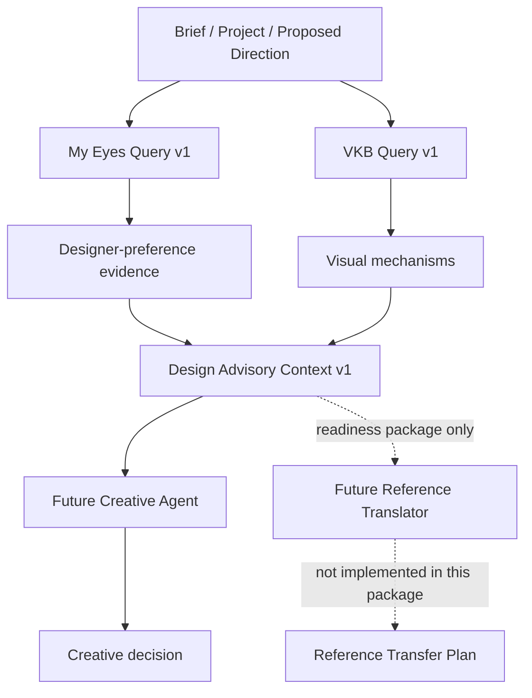

# DESIGN BUILDER — Design Advisory v1 Implementation Report

> Historical phase note: this report correctly records the earlier advisory-only state. Reference Translator Runtime v1 was implemented later on 2026-08-15; see [REFERENCE_TRANSLATOR_RUNTIME_V1_IMPLEMENTATION_REPORT.md](./REFERENCE_TRANSLATOR_RUNTIME_V1_IMPLEMENTATION_REPORT.md) for the current state.


Data da implementação: 2026-08-15  
Escopo: My Eyes Query v1, VKB Query v1, Design Advisory Context v1, shadow-mode hooks, Reference Translator readiness, cenários, testes e regressão.  
Status: implementado e validado.

Este documento é autocontido. Ele foi escrito para permitir que uma pessoa ou outra IA, sem contexto prévio do código, entenda o que foi alterado, por que a solução foi estruturada assim, como os dados fluem, quais invariantes não podem ser quebrados e como continuar o trabalho.

## IMPLEMENTATION SUMMARY

A implementação transforma `MY_EYES_PREFERENCE_MODEL_V1` em memória consultável por contexto e introduz uma consulta VKB determinística baseada em mecanismos. As duas respostas são mantidas separadas e reunidas por `DesignAdvisoryContextBuilder`, que preserva tensões sem decidir por um lado. Foram adicionados hooks somente de leitura em shadow mode e um `ReferenceTranslatorContextBuilder` que empacota contexto, mas não executa tradução criativa nem gera `Reference Transfer Plan`.

O comportamento de Creative Director, Image Critic, Generator Compiler e Generation Service não foi alterado. Nenhum desses runtimes importa ou consome automaticamente os novos módulos.

Estado final:

- My Eyes Preference Model: ativo como memória consultável.
- My Eyes advisory: implementado.
- VKB advisory: implementado.
- Design Advisory Context: implementado.
- Reference Translator context readiness: implementado.
- Reference Translator cognitive runtime: não implementado.
- Creative Director, Critic e Generator: comportamento inalterado.
- Scores, weights, rankings e decisões automáticas: zero.

## ARCHITECTURE DISCOVERED

O repositório já possuía contratos JSON Schema validados por AJV, runtime ESM em Node.js, testes com `node:test`, validação cross-artifact, compiler, geração, critic contracts, Approved Direction Memory e o modelo My Eyes v1 com sete preferências humanas confirmadas.

Estruturas reutilizadas:

- `data/my_eyes/models/MY_EYES_PREFERENCE_MODEL_V1.json` como fonte exclusiva das sete preferências ativas.
- `model_id`, `model_version`, `source_memory_id`, `source_memory_version`, `preference_id`, `human_confirmed`, `confidence`, `evidence_refs`, `exceptions` e `explicitly_not_claimed` existentes.
- `card_execution_profile` e `MYE_IMG_000006` para o caso positivo `approved/6.png`.
- `docs/vkb/DOCUMENTO_05_VKB_DESIGN_BUILDER.md` como especificação de mecanismos, não como evidência humana.
- contratos de Brief Spec e Reference Transfer Plan para manter a separação entre empacotamento de contexto e tradução criativa.
- convenções ESM, `structuredClone`, erros explícitos e testes de mutação existentes.

Não foi necessário evoluir nenhum schema existente. Os novos contratos são contratos executáveis e estritos em `src/advisory/contract-validation.mjs`; por isso não houve mudança retroincompatível em artefatos já persistidos.

O diretório fornecido não foi reconhecido pelo comando `git status` como repositório Git. Isso não bloqueou implementação ou testes, mas significa que este relatório usa inventário de arquivos e resultados executados, não um diff Git.

## ARCHITECTURE AND AUTHORITY FLOW



Advisors nunca alcançam `H` ou `J` diretamente. My Eyes responde “o que a evidência deste designer torna relevante agora?”. VKB responde “quais mecanismos podem responder ao problema?”. Um agente criativo futuro decidirá o que fazer.

## FILE INVENTORY

| Arquivo | Responsabilidade |
|---|---|
| `src/my-eyes/query/my-eyes-query-engine.mjs` | Matching determinístico das sete preferências, full records, compact context, trace e evidência positiva de cards. |
| `src/vkb/query/vkb-mechanism-catalog.mjs` | Catálogo v1 leve de oito mecanismos, cada um com provenance e status não humano. |
| `src/vkb/query/vkb-query-engine.mjs` | Retrieval por dimensões do problema, condições, riscos, anti-patterns e interações. |
| `src/advisory/contract-validation.mjs` | Contratos de entrada parcial, allowlists e validações de autoridade. |
| `src/advisory/compression.mjs` | Orçamento, ordenação por relevância e semantic merge com preservação de IDs. |
| `src/advisory/authority-firewall.mjs` | Bloqueio recursivo de capacidades e campos que cruzariam autoridade. |
| `src/advisory/design-advisory-context-builder.mjs` | Montagem separada My Eyes/VKB e preservação explícita de tensões. |
| `src/advisory/shadow-mode-adapters.mjs` | Hooks públicos não invasivos e declaração de capacidades somente consultivas. |
| `src/reference-translator/context/reference-translator-context-builder.mjs` | Validação e empacotamento de contexto para o futuro translator. |
| `src/advisory/canonical-advisory-scenarios.mjs` | Oito cenários executáveis e suas expectativas. |
| `scripts/run_advisory_scenarios.mjs` | Runner CLI dos cenários. |
| `tests/runtime/*advisory*.test.mjs` | Testes My Eyes, VKB, cross-advisory e cenários. |
| `tests/runtime/authority-firewall.test.mjs` | Firewall, não mutação e mutation tests. |
| `tests/runtime/reference-translator-context.test.mjs` | Readiness e fronteira de não tradução. |

`package.json` ganhou somente `test:advisory` e `scenarios:advisory`. O script `test` existente continua abrangendo todos os arquivos `tests/runtime/*.test.mjs`.

## PHASE A — MY EYES QUERY LAYER

### Input contract

`queryMyEyesAdvisory(query)` exige apenas `query_id`. `project_context` e `creative_context` são opcionais e parciais. Campos desconhecidos no nível de contrato são recusados.

Campos suportados incluem:

- projeto: `project_type`, `format`, `industry_or_domain`, `intended_use`, `brand_context`;
- direção: `concept`, `visual_thesis`, `planned_mechanisms`, `planned_objects`, `planned_effects`, comportamentos de tipografia, complexidade, cor e profundidade;
- sinais estruturados: `cards`, `floating_elements`, `microeffects`, `generic_assembly`, `high_complexity`, `strong_color_impact`;
- escopo opcional e `advisory_budget.max_items`.

Exemplo mínimo:

```js
queryMyEyesAdvisory({
  query_id: "query-001",
  creative_context: {
    planned_objects: ["specific project cards"],
    signals: {
      cards: {
        present: true,
        content_specific: true,
        coherent_grouping: true,
        narrative_role: true
      }
    }
  }
});
```

### Deterministic relevance rules

| Preference | Elegibilidade v1 | Observação |
|---|---|---|
| `MYE_PREF_000008` | complexidade `HIGH`/`VERY_HIGH`, densidade ou sinal estruturado | quantidade não é falha. |
| `MYE_PREF_000009` | objetos, efeitos ou mecanismos planejados | relevância de função visual, não minimalismo. |
| `MYE_PREF_000010` | sinais concretos de montagem genérica | nunca usa rótulo vago como diagnóstico. |
| `MYE_PREF_000011` | microeffects presentes, especialmente sem função declarada | detalhe não é proibido. |
| `MYE_PREF_000012` | elementos floating/suspended/foreground | presença e quantidade não são falha. |
| `MYE_PREF_000013` | impacto cromático, saturação ou contraste planejado | não maximiza saturação/contraste. |
| `MYE_PREF_000016` | cards/panels planejados | cards não são proibidos. |

Sinais estruturados têm prioridade. Fallback textual serve para adaptar contextos de pipeline já existentes, mas cada match é registrado em `trace.eligible_preferences`. Não há LLM, embeddings, banco vetorial ou dependência externa.

### Output contract

O resultado contém `relevant_preferences`, `relevant_failure_signatures`, `conditional_acceptances`, `positive_references`, `counterexamples`, `known_exceptions`, `contextual_warnings`, `uncertainties`, `evidence_refs`, `compact_agent_context`, budget, trace e `authority: ADVISORY_ONLY`.

Cada full record preserva:

- `preference_id` e versão do modelo;
- status de confirmação humana;
- relevância qualitativa, nunca peso;
- insight acionável e sinais operacionais;
- exceções e coisas explicitamente não alegadas;
- evidence refs e confidence originais;
- referência estável usada pelo compact context.

O trace persiste input normalizado, candidatos elegíveis, filtrados, retornados, regras de filtro e ações de compressão. Ele declara `hidden_reasoning_persisted: false`. Isso é rationale estruturada e auditável, não chain-of-thought.

## PHASE B — VKB QUERY LAYER

O catálogo v1 contém oito mecanismos leves: Foreground Occlusion, Subject-Copy Territorial Separation, Controlled Asymmetry, Atmospheric Depth Stacking, Detail Density Gradient, Narrative Information Panels, Localized Color and Contrast e Lighting Cohesion.

Cada mecanismo contém descrição funcional, efeito visual/psicológico, dimensões de input, condições, riscos, anti-patterns, relações e provenance. Os exemplos vindos da seção 6.2 da especificação são marcados `VKB_SPECIFICATION_ILLUSTRATIVE_SEED`; mecanismos derivados de princípios gerais são marcados como derivados; Narrative Information Panels é marcado como requisito canônico do work package. Nenhum é apresentado como preferência humana.

`queryVkbAdvisory` roteia `project_goals`, emoção e problemas de hierarquia, profundidade, composição, luz, cor, integração, tipografia e reference transfer. O output sugere mecanismos; não produz composição, conceito, câmera, copy, paleta ou direção final.

Esta escolha mantém o dataset pequeno, auditável e substituível. Uma versão futura pode trocar o catálogo seed por uma VKB baseada em casos reais sem alterar a responsabilidade pública do query engine.

## PHASE C — DESIGN ADVISORY CONTEXT

`DesignAdvisoryContextBuilder` converte Brief/project/proposed direction em duas queries distintas. As respostas completas permanecem sob `my_eyes` e `vkb`; não existe uma lista fundida de “verdades”.

Duas tensões canônicas são preservadas:

1. `CROSS_TENSION_FLOATING_FOREGROUND`: VKB oferece foreground occlusion; My Eyes exige função, placement, lighting e integração dos elementos floating.
2. `CROSS_TENSION_INFORMATION_PANELS`: VKB oferece panels como exposição; My Eyes alerta para dashboard cards genéricos e exige especificidade/narrativa.

Cada conflito mantém refs para os dois full records, `PRESERVED_UNRESOLVED` e `resolution_authority: FUTURE_CREATIVE_AGENT`. `trace.automatic_resolutions` é sempre vazio nesta versão.

## PHASE D — SHADOW MODE

Hooks preparados:

```js
getMyEyesAdvisory(query)
getVkbAdvisory(query)
getDesignAdvisoryContext(input)
```

Todos clonam inputs, aplicam firewall e retornam dados consultivos. `SHADOW_MODE_INTEGRATION` declara explicitamente:

- consumers não são obrigados a obedecer;
- prompt injection existente: false;
- comportamento de runtime existente alterado: false;
- geração, aprovação, avaliação e escrita downstream: false.

Prova estrutural: nenhum arquivo em `src/compiler`, `src/generators` ou `src/validation` foi modificado para importar advisory; nenhuma alteração foi feita em schemas de Final Frame, compiler input ou compiled generation request. A regressão desses componentes passou.

## PHASE E — REFERENCE TRANSLATOR READINESS

`ReferenceTranslatorContextBuilder` aceita:

- `brief_ref` obrigatório, com `artifact_id` e `schema_version`;
- `reference_context` opcional;
- advisories My Eyes e VKB opcionais e separados;
- `protected_semantics`, `identity_constraints` e `transfer_scope`.

O builder clona os dados e registra validação. Ele não observa imagem, não escolhe o que transferir, não cria mappings, não resolve conflitos e não produz Reference Transfer Plan. Campos como `design_decision_map` são recusados. O output declara `future_translator: NOT_IMPLEMENTED`, `creative_translation_performed: false`, `transfer_choices_created: false` e `output_plan_created: false`.

## CANONICAL ADVISORY SCENARIOS

| Cenário | Resultado |
|---|---|
| 1 — High complexity | `MYE_PREF_000008` relevante; nenhuma redução por contagem. PASS. |
| 2 — Floating elements | `MYE_PREF_000012` relevante; nenhuma remoção universal. PASS. |
| 3 — Generic cards | card + generic assembly relevantes e sinais concretos. PASS. |
| 4 — Good card context | conditional acceptance + `approved/6.png` como mecanismo, não template. PASS. |
| 5 — Microdetail pollution | `MYE_PREF_000011` relevante. PASS. |
| 6 — Color | color vitality contextual, sem maximização. PASS. |
| 7 — Low relevance | cards/floating/microeffects omitidos; zero diluição. PASS. |
| 8 — VKB/My Eyes tension | tensão preservada, zero auto-resolution. PASS. |

Runner: `npm run scenarios:advisory`.

## ADVISORY COMPRESSION

Full records preservam toda provenance necessária. Compact records preservam `actionable_insight`, exceção importante, confidence, warning, `source_preference_ids` e `full_record_refs`.

O semantic merge reúne mensagens sobre complexidade/função/microdetail ou generic assembly/floating/cards quando elas repetiriam a mesma ideia. Ele nunca apaga os IDs de origem. O budget padrão é cinco itens por advisor e pode ser reduzido por query. Itens excedentes ficam registrados no trace como `MAX_ITEMS`.

## AUTHORITY FIREWALL

O firewall percorre payloads recursivamente e rejeita capacidades como direção selecionada, critic outcome, aprovação, escrita de Final Frame, compiled request, geração/regeneração, score, weight, ranking, proibição universal de cards/floating, rótulo genérico sem decomposição, cópia de layout positivo e criação de Reference Transfer Plan/mapping pelo builder.

Também existe `assertProtectedArtifactsUnchanged(before, after)` para provar que shadow-mode não modificou domínios protegidos.

## GENERIC AI SIGNATURE HANDLING

A implementação nunca usa “avoid AI look” ou “make it less AI-generated” como instrução. O candidato é decomposto em sinais como dashboard cards genéricos, objetos decorativos iluminados independentemente, microdetails sem função, partículas arbitrárias, glow sem motivação, módulos UI repetidos, elementos intercambiáveis, cor/contraste desconectados, filler cinematográfico e floating elements mal integrados.

Se o input tentar inserir `avoid_ai_look: true`, o contrato/firewall recusa o campo. Se fornecer `generic_assembly.concrete_signals`, os sinais são preservados no advisory e no trace.

## CARD HANDLING

Tratamento negativo: modules intercambiáveis, métricas genéricas, repetição de border/glow/chart, competição entre cards e placement orbital sem função.

Tratamento positivo: conteúdo específico, grouping coerente, hierarchy, narrative role, spatial integration, breathing room e subordinação ao sujeito.

`approved/6.png` só aparece quando o contexto declara condições positivas. O rationale explica mecanismo. `is_template` é false e `usage_boundary` proíbe reproduzir shape do cluster, paleta, densidade, ângulos, contagem ou pixels.

## COUNTEREXAMPLES / EXCEPTIONS

Exceções e `explicitly_not_claimed` são copiadas do modelo humano para cada full record. Assim, um advisory pode alertar sobre microdetail e simultaneamente preservar que detail não é ruim; pode alertar sobre floating execution e preservar que um ou muitos elementos podem funcionar; pode alertar sobre color e preservar paletas restritas; pode recuperar cards sem transformá-los em regra universal.

## ENGINEERING RATIONALE

Esta seção registra decisões reproduzíveis de engenharia, não raciocínio interno oculto.

- Determinismo foi escolhido porque há apenas sete preferências e oito mecanismos seed. Regras explícitas são mais auditáveis que embeddings/LLM neste volume.
- Relevance é qualitativa para evitar que retrieval seja confundido com preferência ponderada.
- My Eyes lê o modelo humano existente, evitando duplicar ou reinterpretar evidência.
- VKB usa provenance não humana explícita porque a documentação contém exemplos ilustrativos, não casos confirmados.
- Full + compact resolve o conflito entre auditabilidade e context bloat.
- Conflitos são objetos de primeira classe porque resolver automaticamente promoveria advisors a creative authority.
- Shadow adapters não foram conectados a prompts para permitir validação de retrieval antes de qualquer mudança comportamental.
- O Reference Translator recebeu somente packaging porque implementar seu runtime cognitivo violaria o escopo deste work package.

## TEST RESULTS

- Nova suíte advisory: 51/51 testes passaram.
- Cenários advisory: 8/8 cenários e 20/20 expectativas passaram.
- Mutation tests incluídos: bans universais, vague label, preference weight, layout copy, critic outcome, selected direction, approval, Final Frame, compiled request, generation e transfer mapping.

## REGRESSION

- `npm test`: 307/307 testes passaram; 0 falhas, 0 skips.
- Desses, 51 são novos e 256 são testes preexistentes de My Eyes, evidências humanas/externas, pairwise, preferences, compiler, generation, transports, critic contracts, schemas em runtime e validação cross-artifact.
- Validação de schemas: 14/14 schemas com fixtures; 55/55 fixtures passaram.
- Cenários end-to-end preexistentes: 3/3 passaram.
- Checks cross-artifact: 345/345 passaram (`99 + 153 + 93`), 0 warnings e 0 blocks.

Comandos reproduzíveis:

```powershell
npm run test:advisory
npm run scenarios:advisory
npm test
node scripts/validate_all_scenarios.mjs
node scripts/validate_schema.mjs <schema_name>
```

## SCORES CREATED

0.

## WEIGHTS CREATED

0.

## RANKINGS CREATED

0.

## CREATIVE DIRECTOR BEHAVIOR CHANGED

NO.

## CRITIC BEHAVIOR CHANGED

NO.

## GENERATOR BEHAVIOR CHANGED

NO.

## HUMAN ACTIONS REQUIRED

NONE.

Nenhuma evidência humana, imagem, credencial ou decisão externa foi necessária ou inventada.

## TECHNICAL DEBT

1. O catálogo VKB é um seed derivado da especificação, não um graph de casos reais. Substituir por conhecimento ingerido com provenance real é evolução legítima.
2. Os contratos advisory são executáveis em JavaScript e não artefatos JSON Schema persistidos. Se advisories passarem a cruzar processos/filas, schemas versionados devem ser adicionados antes.
3. O matching textual é deliberadamente pequeno. Novos sinônimos devem entrar por testes canônicos, sem transformar a v1 em classificador opaco.
4. Não há persistence de queries/traces. Se for adicionada, deve guardar apenas rationale estruturada, nunca scratchpad ou chain-of-thought.

## HOW ANOTHER AI SHOULD CONTINUE

1. Leia este documento e os quatro entrypoints: My Eyes query, VKB query, Design Advisory Context Builder e Reference Translator Context Builder.
2. Rode `npm test` antes de alterar qualquer contrato.
3. Preserve `ADVISORY_ONLY`, IDs/evidence refs e as respostas separadas.
4. Adicione um cenário e mutation test para qualquer nova regra.
5. Não conecte advisory a prompt, critic, compiler ou generation sem um work package explicitamente autorizando mudança comportamental.
6. Ao implementar o Reference Translator Runtime v1, consuma o readiness context, produza um artefato separado validado pelo schema existente e mantenha Creative Director como autoridade final.
7. Depois da mudança, rode a suíte advisory, os cenários advisory, `npm test`, todos os schemas aplicáveis e a regressão cross-artifact.

## NEXT RECOMMENDED PHASE

REFERENCE TRANSLATOR RUNTIME v1.

Não foi implementado automaticamente neste work package.

