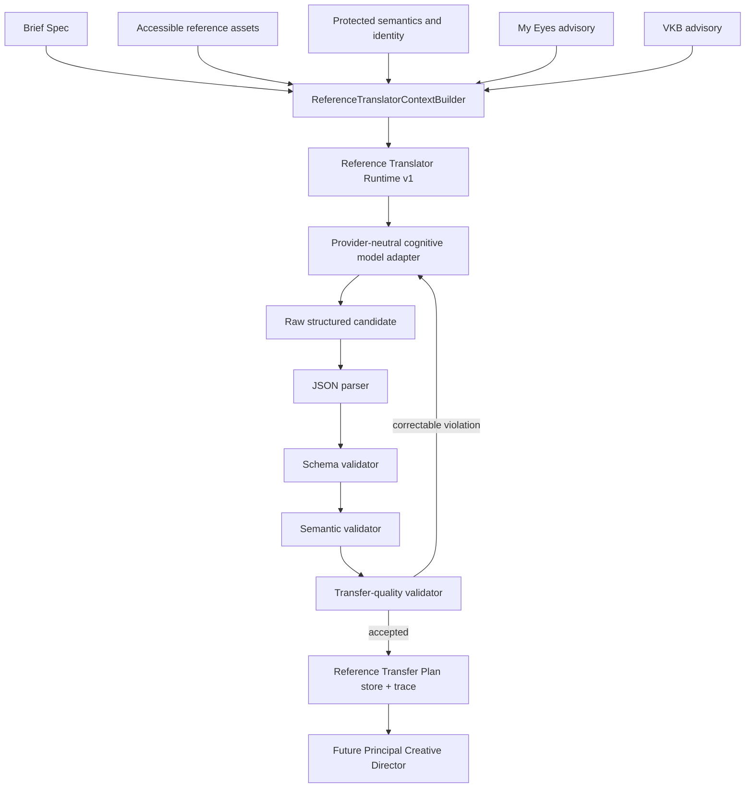
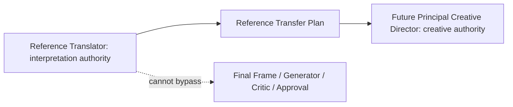

# Design Builder — Reference Translator Runtime v1

Implementation date: 2026-08-15  
Status: implemented and validated  
Scope: cognitive-agent prompt, provider-neutral runtime, parsing, schema/semantic/quality validation, retries, persistence, traces, evaluation harness, adversarial tests, canonical scenarios, and cross-category product adaptation.

## Implementation summary

Reference Translator is now an executable cognitive art-direction stage. It consumes a validated Brief Spec, accessible reference assets, protected semantics, identity constraints, and separate My Eyes/VKB advisories. It invokes a provider-neutral cognitive model adapter, parses one raw JSON candidate, validates it against the existing Reference Transfer Plan contract plus deterministic semantic and quality rules, retries correctable failures, persists the accepted plan and structured trace, and returns upstream of the future Principal Creative Director.

The runtime never creates Creative Direction, Final Frame, critic verdicts, generation requests, scores, weights, rankings, or approvals.

The user-requested cross-category behavior is first-class. A support prop from another product category cannot use direct `TRANSFER`. It must use `ADAPT`, `REINVENT`, or `DISCARD`, and must record the literal object, visual function, material language, emotional effect, equivalent target-native adaptation, category pair, and coherence rationale.

## Repository inspection

The implementation reused:

- `schemas/reference_transfer_plan.schema.json` and the shared AJV validator;
- `schemas/brief_spec.schema.json` as upstream truth;
- `ReferenceTranslatorContextBuilder` as the readiness boundary;
- the My Eyes and VKB compact advisory contracts without merging their authority;
- the advisory authority doctrine and existing ESM/`structuredClone` conventions;
- append-safe atomic JSON persistence patterns used by generation;
- `node:test`, canonical scenario runners, mutation-test conventions, and typed errors.

The supplied directory is not recognized by Git as a repository, so verification is based on an exact file inventory and executed tests rather than a Git diff.

## Reference Translator agent

- Identity: `REFERENCE_TRANSLATOR`
- Authority: `REFERENCE_INTERPRETATION_ONLY`
- Runtime version: `1.0.0`
- Prompt version: `REFERENCE_TRANSLATOR_AGENT_V1`
- Prompt: `prompts/reference-translator/reference-translator-agent-v1.md`
- Prompt size: 17,044 bytes / 345 lines

The prompt is one canonical operating manual. Its distinct sections cover authority, observation versus decision, function before appearance, mechanism versus manifestation, cross-category adaptation, composition, subject/camera/crop, hierarchy, density, complexity, depth, lighting, color, materials, typography, objects, semantic substitution, cards, generic assembly, relevance, conflicts, protected semantics, My Eyes, VKB, failure modes, self-checks, raw JSON, and no chain-of-thought storage.

### Prompt quality audit

The prompt uses one doctrine statement followed by dimension-specific operating rules and examples. Static tests require core section names and invariants without snapshotting the entire file. It avoids five duplicated prompt fragments, vague style labels, and provider-specific instructions. Reference metadata and visible reference text are explicitly untrusted content.

## Cross-category product adaptation

The schema gained one backward-compatible optional mapping field:

`design_decision_map[].cross_category_adaptation`

Its required internal fields are:

- `reference_product_category`
- `target_product_category`
- `literal_object`
- `visual_function`
- `material_language`
- `emotional_effect`
- `equivalent_adaptation`
- `literal_transfer_allowed` (constant `false`)
- `target_category_coherence`

Existing 1.0 fixtures remain valid. The new canonical fixture uses schema version 1.1.0.

Runtime enforcement activates when an accessible reference asset declares a different `product_category` and identifies `product_support_observation_ids`. Every such observation requires a decision. Direct transfer, missing decomposition, category mismatch, repeated literal equivalent, or incorrect literal-object identification blocks the candidate and enters bounded correction retry.

Canonical example:

- base: warm woody amber perfume;
- reference category: skincare;
- source support prop: handbag;
- transferable function: soft fashion luxury and controlled secondary mass;
- transferable material/emotional logic: supple matte warmth, tactile richness, intimate editorial sophistication;
- target-native equivalent: cognac leather, dark suede, or an amber-toned tactile support surface;
- literal handbag transfer: forbidden.

## Runtime architecture



Authority boundary:



## Public API

The public entrypoint is `src/reference-translator/index.mjs`.

```js
const result = await executeReferenceTranslator({
  context,
  brief_spec,
  reference_assets,
  model_adapter,
  run_options: {
    run_id,
    project_id,
    target_product_category,
    max_attempts: 3
  },
  store
});
```

Reference assets must declare visual access:

- `MULTIMODAL`: URI or bytes are supplied to an image-capable adapter;
- `STRUCTURED_TEST`: deterministic synthetic observations are explicit;
- inaccessible, filename-only, or metadata-only input blocks before model invocation.

Normal tests use `ScriptedCognitiveModelAdapter`; no provider credentials are needed.

## Parsing and validation

The parser accepts a JSON object or raw JSON string. It rejects empty content, arrays, invalid JSON, surrounding commentary, and Markdown fences. It performs no semantic repair.

Validation stages:

1. JSON Schema validation against the real contract.
2. Semantic validation for supplied asset/observation provenance, project and brief version, no-reference hallucination, protected semantics, identity, brand/text leakage, advisory authority, Director impersonation, self-approval, and cross-category support adaptation.
3. Quality validation for undertransfer, overtransfer, surface copying, generic rationale, vague AI labels, direct narrative-object transfer, functionless filler, and inadequate cross-category specificity.

Retries receive only concise diagnostic codes, paths, and messages. Hidden reasoning is never stored or returned.

## Error taxonomy

The typed `ReferenceTranslatorError` supports:

- `REFERENCE_CONTEXT_INVALID`
- `REFERENCE_VISUAL_CONTENT_UNAVAILABLE`
- `MODEL_INVOCATION_FAILED`
- `MODEL_OUTPUT_INVALID_JSON`
- `REFERENCE_PLAN_SCHEMA_INVALID`
- `REFERENCE_PLAN_SEMANTIC_INVALID`
- `REFERENCE_PLAN_UNDERTRANSFER`
- `REFERENCE_PLAN_OVERTRANSFER`
- `REFERENCE_PLAN_IDENTITY_VIOLATION`
- `REFERENCE_PLAN_AUTHORITY_VIOLATION`
- `REFERENCE_PLAN_RETRY_EXHAUSTED`
- `REFERENCE_PLAN_PERSISTENCE_FAILED`
- `REFERENCE_RUN_IDEMPOTENCY_CONFLICT`

## Retry behavior

The cap is one to three attempts, default three. Invalid JSON, schema violations, semantic violations, identity/authority violations, undertransfer, overtransfer, and surface-copy defects may be corrected within the same limited authority. Retries do not authorize concept selection or downstream design.

A failed final attempt raises `REFERENCE_PLAN_RETRY_EXHAUSTED` with structured attempt and diagnostic summaries.

## Persistence and trace

Default storage:

- `data/reference-translator/plans/<plan_id>.json`
- `data/reference-translator/runs/<run_id>.trace.json`

Writes are atomic and do not overwrite by default. A repeated `run_id` plus identical input hash returns an idempotent replay. Changed input under the same run ID raises a conflict.

Trace fields include run/runtime/prompt version, SHA-256 input hash, context and reference refs, advisory refs, adapter ID, stage events, attempt outcomes, validation outcomes, accepted plan ID, compact decision summary, and warnings. Image bytes, secrets, full prompts, scratchpads, and chain-of-thought are not persisted.

Event flow:

`CONTEXT_VALIDATED -> PROMPT_ASSEMBLED -> MODEL_INVOKED -> OUTPUT_PARSED -> SCHEMA_VALIDATED -> SEMANTIC_VALIDATED -> QUALITY_VALIDATED -> PLAN_PERSISTED -> COMPLETE`

Failure attempts record only stage, code, and diagnostic codes.

## No-reference mode

When the Brief explicitly declares no reference, the runtime performs no model invocation. It returns a schema-valid zero-transfer result with:

- `transfer_intensity.value = NONE`;
- empty `reference_analyses`;
- empty `design_decision_map`;
- no reference anchors;
- an explicit warning that downstream stages must not infer reference DNA.

This runtime result is diagnostic for the stage; existing cross-artifact flows still omit a Reference Transfer Plan when their no-reference manifest requires no plan.

## Canonical scenarios

The categorical harness covers all required scenario families:

A. no reference  
B. strong reference  
C. website hero  
D. edit mode  
E. reference conflicts with My Eyes  
F. high complexity  
G. minimal reference  
H. format mismatch  
I. identity protection  
J. surface-copy trap  
K. undertransfer trap  
L. overtransfer trap  
M. generic AI reference  
N. card reference  
O. typography-heavy reference

J, K, and L intentionally fail their first scripted candidates and pass only after diagnostic correction. The harness creates no numeric design score.

## Adversarial and mutation coverage

Coverage includes literal palette/font/object bait, cross-category prop transfer, brand leakage, visible-text leakage, protected identity replacement, missing observation provenance, inaccessible images, filename hallucination, no-reference hallucination, invalid/fenced JSON, unknown enums, generic mood, vague AI labels, functionless particles/leaves/glow/microdetails, advisory escalation, Director impersonation, self-approval, downstream fields, retry exhaustion, input immutability, persistence safety, and idempotency conflicts.

Controlled intentional complexity is positively tested so element count does not become a simplification rule. Functional lighting translation is positively tested so glow is not treated as a universal ban.

## Test results

- Reference Translator suite: 45/45 passed.
- Canonical Reference Translator scenarios: 15/15 passed.
- Advisory suite: 51/51 passed.
- Canonical advisory scenarios: 8/8 passed.
- Full repository regression: 344/344 passed; 0 failures; 0 skips.
- All repository schemas: 14/14 schema families and 57/57 fixtures passed.
- Applicable adjacent schema fixtures: 24/24 passed:
  - Reference Transfer Plan: 6/6
  - Brief Spec: 5/5
  - Creative Direction Spec: 6/6
  - Final Frame Spec: 7/7
- Existing end-to-end artifact scenarios: 3/3 passed.
- Existing cross-artifact checks: 345/345 passed; 0 warnings; 0 blocks.
- Live smoke: `SKIP` by design because no external scenario/model adapter is configured.

Commands:

```powershell
npm run test:reference-translator
npm run scenarios:reference-translator
npm run smoke:reference-translator
npm run test:advisory
npm run scenarios:advisory
npm test
node scripts/validate_schema.mjs reference_transfer_plan
node scripts/validate_all_scenarios.mjs
```

## Authority and behavior invariants

- Scores created: 0
- Weights created: 0
- Rankings created: 0
- Automatic approvals created: 0
- Creative Director behavior changed: NO
- Image Critic behavior changed: NO
- Generator behavior changed: NO
- Compiler behavior changed: NO
- My Eyes authority changed: NO
- VKB authority changed: NO

## Live model status

No live cognitive-model provider is configured or claimed. `npm run smoke:reference-translator` returns a successful `SKIP`. A future integration can supply `REFERENCE_TRANSLATOR_LIVE_SCENARIO_MODULE` exporting a complete request with a real image-capable `model_adapter`.

## Human actions required

NONE.

No image classification, human preference, API key, or unstated product decision was invented.

## Technical debt

1. Cross-category enforcement depends on explicit source/target product categories and explicit support-observation IDs from orchestration. A future multimodal intake layer should produce these declarations with provenance.
2. Quality heuristics are deliberately transparent lexical/structural rules; future changes should add adversarial fixtures before expanding them.
3. No production live cognitive-model adapter is included. The port and smoke contract are ready for an external provider implementation.
4. Trace persistence is local JSON. A shared artifact service can replace it later without changing the executor contract.

## Continuation guide

The next agent should consume:

Brief Spec + Reference Transfer Plan + My Eyes Advisory + VKB Advisory

and produce:

Creative Direction Spec

through Principal Creative Director Runtime v1.

Reference Translator must remain upstream and limited. Do not let the Creative Director bypass protected semantics or treat a target-native equivalent as permission to restore the literal source prop.

## Next recommended phase

PRINCIPAL CREATIVE DIRECTOR RUNTIME v1.

Do not implement it automatically as part of this package.
